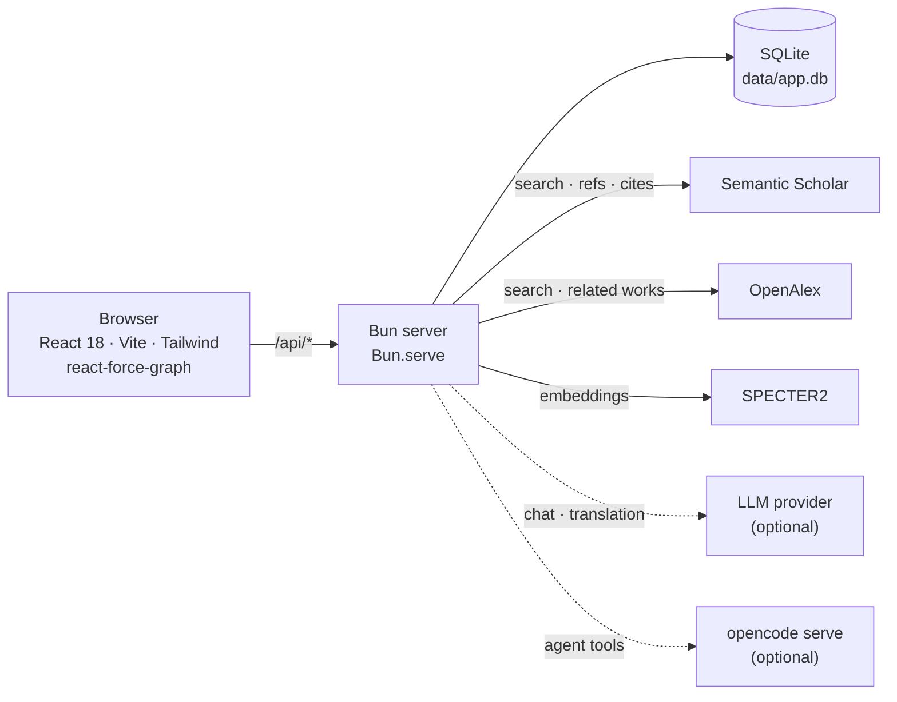

# Academic Paper Explorer

**Search papers, map their citation networks, and find out how any two papers are actually connected.**

[](https://github.com/benbenlijie/connectedpapers/actions/workflows/ci.yml)
[](LICENSE)
[](https://bun.sh)
[](https://react.dev)
[](CONTRIBUTING.md)

**[Live demo →](https://watchdeep.net/paper-demo/)** · [中文说明](README.zh-CN.md) · [Architecture](ARCHITECTURE.md)


Self-hosted and local-first: one Bun process, one SQLite file, no account, no cloud.

---

## Why another paper explorer?

Tools like Connected Papers show you the neighbourhood of **one** paper. That answers "what is around this paper?" — but not the question you have when two papers are already in front of you: **"how are these two related?"**

Academic Paper Explorer is built around that second question, and around owning your own data.

| | Connected Papers & similar | Academic Paper Explorer |
| --- | --- | --- |
| Neighbourhood graph | ✅ | ✅ |
| "How are these two papers connected?" | ❌ | ✅ an explained path, hop by hop, with alternatives |
| Runs on your own machine | ❌ | ✅ single Bun process + SQLite file |
| Read + translate the paper in-app | ❌ | ✅ arXiv HTML reader with bilingual mode |
| Ask an AI that has actually read the paper | ❌ | ✅ retrieval over the full text before it answers |
| Notes, favourites, collections | limited | ✅ local, exportable |

## How two papers are related

Pick any two papers and the app searches for the chain that links them, then explains each hop in plain language.


- **An answer, not just a graph.** "Both are cited by *Uni-AdaFocus*, so they are usually discussed together" — that is the whole point.
- **Paths are ranked by evidence.** Direct reference (1.0) › citation (0.95) › bibliographic coupling (0.8) › related work (0.6) › embedding similarity (0.45). Single-hop answers are labelled by their edge type; multi-hop ones as co-citation, coupling, or a chain.
- **Alternatives are shown**, so you can tell a robust connection from a coincidental one.
- **Signals alongside the path**: shared references, shared citers, embedding similarity, shared fields, shared authors.
- **Four tiers, cheapest first**: fetch the two endpoints best-effort → walk relations already stored locally → a budgeted live crawl → an embedding bridge as a last resort. Ask for a local-only answer when you want it instantly and offline.

## Features

### Explore

- **Search** across Semantic Scholar and OpenAlex, merged and de-duplicated by DOI/arXiv id, with locally remembered keyword history.
- **Interactive citation network** — PageRank-weighted nodes, Louvain community clustering, per-edge-type visibility toggles, and a timeline you can scrub or play back to see a field grow.
- **2D canvas or 3D** force graph, whichever suits the question.
- **Node context menu**: rebuild the graph from here, re-search by title, expand this node, add to comparison, open the original.
- **Multi-source relation edges**: citations and references, Semantic Scholar recommendations, OpenAlex related works (with an arXiv title fallback), bibliographic coupling, and SPECTER2 embedding kNN — normalised so the same paper never appears twice.
- **Graph caching** of nodes, edges *and* layout, so reopening a network is instant instead of re-running the simulation.

### Compare

Two papers side by side, each with its own citation graph, sharing the filters and encodings — or hand the pair straight to the relation analysis with one click.


### Read

- **In-app reading** of arXiv HTML with a section outline; papers without an HTML build fall back to abs/PDF.
- **Immersive bilingual translation** per paragraph, with any OpenAI-compatible provider, or entirely in-browser via the built-in Translator API.
- **AI reading assistant** driven by a local [`opencode`](https://opencode.ai) agent. It calls retrieval tools (`paper_search`, `paper_section`) before answering and streams what it is doing ("searching…", "reading section 3"), so answers come from the paper rather than the model's memory.
- **Reading queue and progress** — to-read / reading / done, plus scroll progress per paper.
- **Highlights and annotations** in four colours, stored locally.


### Keep and share

- **Notes, favourites, collections** and saved searches, all local.
- **Import/export**: PNG of the current view, JSON, BibTeX, CSV, or the full crawled network as JSON.
- **Shareable deep links.** The paper, filters, encoding, view mode and the compared pair all round-trip through the URL — including `?from=<id>&to=<id>`, which re-runs a relation analysis for whoever opens it.
- **Optional access token** if you put it on a public host.

## Quick start

Requires **[Bun](https://bun.sh) ≥ 1.3** and **pnpm 9**.

```bash
git clone https://github.com/benbenlijie/connectedpapers.git
cd connectedpapers
bash scripts/setup.sh      # installs both dependency trees, creates data/, copies server/.env
bun run build:web          # build the frontend
bun run server             # http://127.0.0.1:8787
```

That is a fully working local instance. Searching works immediately; adding a free `SEMANTIC_SCHOLAR_API_KEY` to `server/.env` makes upstream calls much more comfortable.

Working on the frontend (`/api` is proxied to 8787, with hot reload):

```bash
bun run server        # terminal A
bun run dev:web       # terminal B
```

## Architecture



Everything is one process: the Bun server serves the built frontend, the JSON API, and the SQLite database. Upstream responses are persisted, so graphs, relation edges and paper text get faster the more you use it — and a local-only relation answer needs no network at all.

```
connectedpapers/
├── academic-paper-explorer/   # React frontend (src/, components/, graph/, store/)
├── server/                    # Bun backend: routes, upstream clients, SQLite, graph search
│   ├── pathfind.ts            # pure path search + ranking + explanation
│   └── connect.ts             # the four-tier relation search
├── scripts/                   # setup.sh, deploy.sh, opencode-local.ts
└── docs/images/               # screenshots used by this README
```

See [ARCHITECTURE.md](ARCHITECTURE.md) for the long version.

## Configuration

`server/.env` (copied from `server/.env.example` by `setup.sh`). Everything is optional — the defaults run offline against an empty database.

| Variable | Default | Purpose |
| --- | --- | --- |
| `PORT` | `8787` | Listen port (loopback only). |
| `HOST` | `127.0.0.1` | Set to `0.0.0.0` only if you add your own TLS/reverse proxy. |
| `ACCESS_TOKEN` | – | If set, the whole app requires this token (`?token=…` sets a cookie). Leave unset for an open instance. |
| `RATE_LIMIT_PER_MIN` | `120` | Per-IP requests/minute on `/api/*`. `0` disables. |
| `TRUST_PROXY` | off | Read the client IP from `X-Real-IP` / `X-Forwarded-For` — only behind a proxy you control. |
| `SEMANTIC_SCHOLAR_API_KEY` | – | Without it you share S2's anonymous rate limit. |
| `OPENALEX_API_KEY` | – | Avoids OpenAlex's anonymous limit. |
| `S2_MIN_INTERVAL_MS` | `100`/`1000` | Minimum spacing between S2 calls (the default depends on whether a key is set). |
| `OPENALEX_MIN_INTERVAL_MS` | – | Same, for OpenAlex. |
| `CONNECT_MAX_EXPANSIONS` | `6` | Live S2 batch fetches allowed per relation search. |
| `CONNECT_MAX_MS` | `25000` | Wall-clock budget for one relation search. |
| `CONNECT_LOCAL_ONLY` | off | `1` = answer only from stored relations, never fetch. |

**LLM / translation provider** — an ordered fallback list; `kind: "browser"` needs no key and runs entirely in the visitor's browser:

```env
LLM_PROVIDERS=[{"name":"local","kind":"openai","baseUrl":"https://<host>/v1","apiKey":"sk-...","model":"..."},{"name":"browser","kind":"browser"}]
```

**AI assistant** — needs the `opencode` binary on the host; the server starts `opencode serve` on demand and reuses the first `openai` provider above:

```env
OPENCODE_ENABLED=1            # 0 disables the assistant
OPENCODE_BIN=opencode         # absolute path if it is not on PATH
OPENCODE_PORT=4096
AI_MAX_STEPS=8                # tool steps per turn
PAPER_CONTENT_TTL_HOURS=168   # paper-text cache TTL
INTERNAL_TOKEN=               # shared secret for the internal retrieval API; random per boot if unset
```

Without an `openai` provider or with opencode unavailable, `/api/ai/*` returns `503` and translation is unaffected.

## API

| Route | What it does |
| --- | --- |
| `POST /api/search` | Search papers across sources. |
| `POST /api/details` | Paper details (authors, venue, citation counts, abstract). |
| `POST /api/network` | Fetch or build a citation network. |
| `POST /api/connect` | **Relate two papers**: `{from_id, to_id, live?, max_hops?}` → ranked paths, per-hop explanation, signals. |
| `GET /api/neighbors/:id` | Locally stored relations for a paper. |
| `POST /api/lineage` | Citation lineage. |
| `GET /api/reader/:arxivId` | arXiv HTML for the in-app reader. |
| `POST /api/translate` | Batch translation via the configured provider. |
| `POST /api/ai/session` · `POST /api/ai/chat` · `GET /api/ai/stream` · `GET /api/ai/history` · `POST /api/ai/abort` | AI assistant session, streaming answers and tool activity. |
| `GET /api/llm/status` | Which LLM/translation providers are available. |
| `GET /api/jobs/:id` | Background job status. |
| `GET /api/paper/session/:id/search?q=` · `GET /api/paper/session/:id/section/:idx` | Full-text retrieval used by the assistant's tools (`X-Internal-Token`). |

## Development

```bash
bun run test:server                        # backend (214 tests)
pnpm --dir academic-paper-explorer test    # frontend (408 tests)
bun run typecheck:server
pnpm --dir academic-paper-explorer typecheck
pnpm --dir academic-paper-explorer lint
```

CI runs exactly these on every push and pull request. See [CONTRIBUTING.md](CONTRIBUTING.md) for the commit convention and the development workflow.

## Deployment

`bun run deploy` builds the frontend and rsyncs the tree to a host you configure in `scripts/deploy.sh`, then restarts the service and health-checks the URL. The bundled guide covers a sub-path deployment behind nginx with TLS, the token gate, and running it as a systemd unit — see [DEPLOYMENT_GUIDE.md](DEPLOYMENT_GUIDE.md).

> The [live demo](https://watchdeep.net/paper-demo/) is a second instance of the same build with `ACCESS_TOKEN` unset, a snapshot database, tighter rate limits and no LLM configured — so the AI assistant and LLM translation are disabled there. It exists to try the app, not to hold your data.

## Roadmap

- [ ] Export a relation path as a citable figure / BibTeX snippet.
- [ ] Zotero and BibTeX library import.
- [ ] Full-text search over locally cached paper text.
- [ ] Postgres backend for multi-user deployments.

Ideas and bug reports are welcome in [issues](https://github.com/benbenlijie/connectedpapers/issues).

## Contributing

Contributions are welcome — see [CONTRIBUTING.md](CONTRIBUTING.md) and [CODE_OF_CONDUCT.md](CODE_OF_CONDUCT.md). Security issues: please follow [SECURITY.md](SECURITY.md) instead of opening a public issue.

## License

[MIT](LICENSE).
