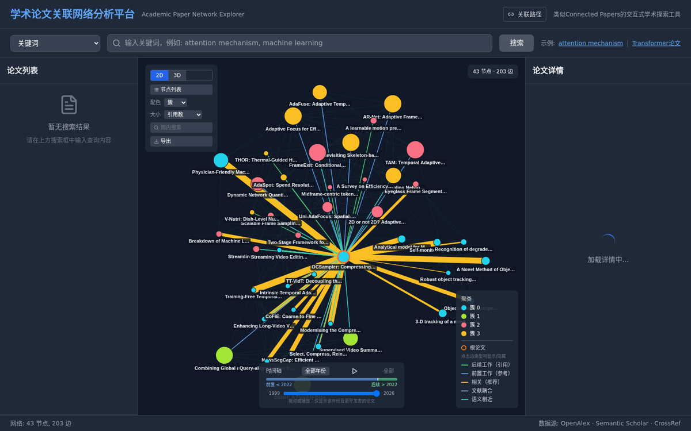
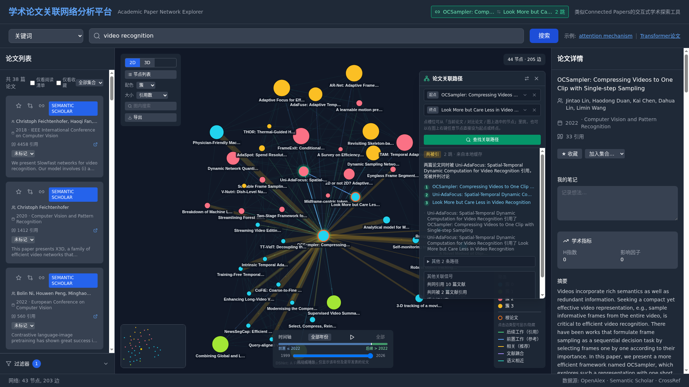
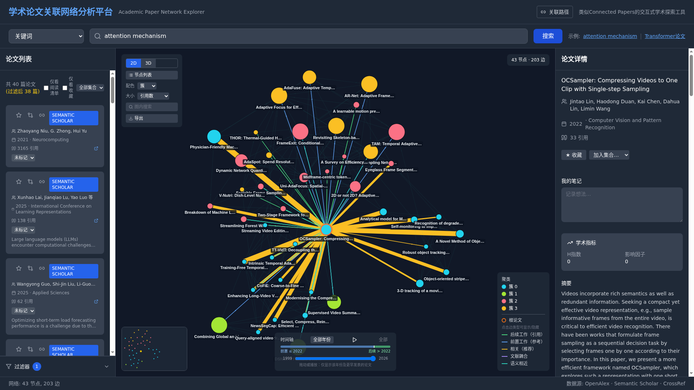
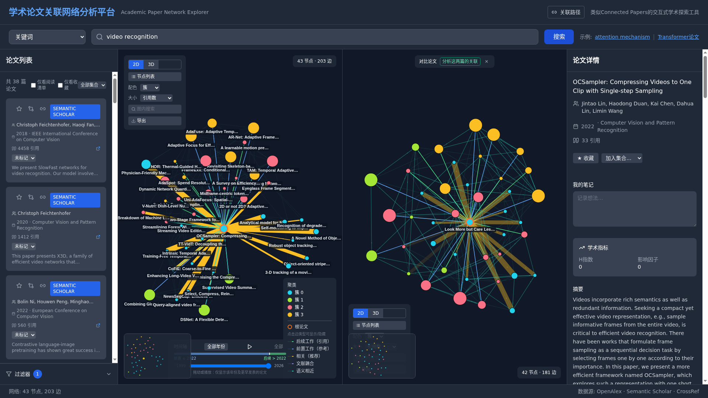
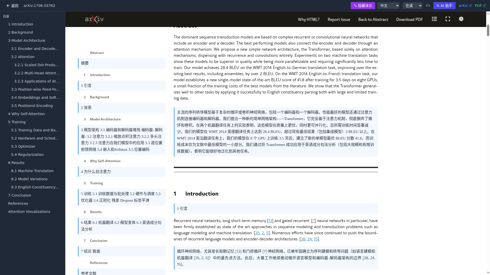
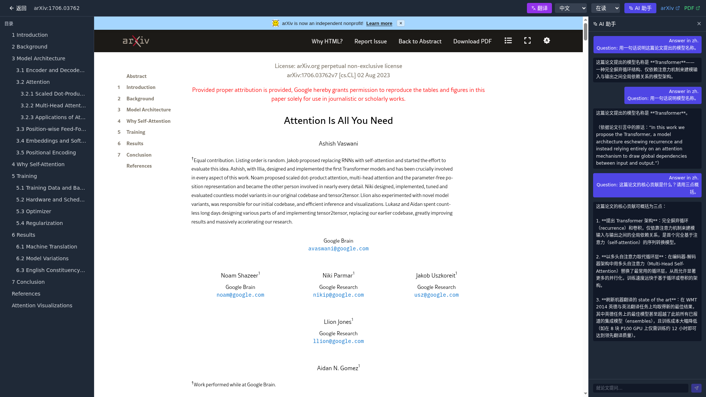
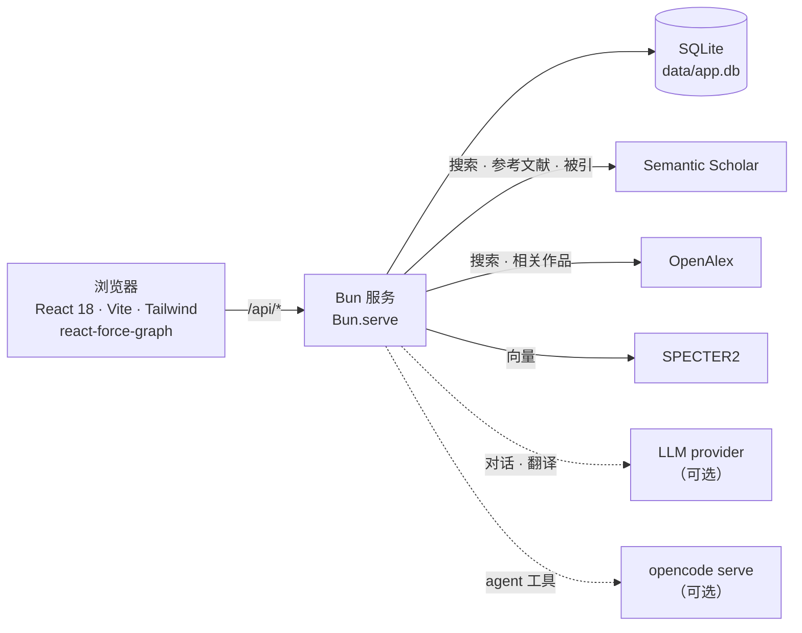

# CiteDuo · 学术论文关系网络探索器

**搜索论文、展开引用网络，并查清任意两篇论文之间到底是怎么连上的。**

[](https://github.com/benbenlijie/citeduo/actions/workflows/ci.yml)
[](LICENSE)
[](https://bun.sh)
[](https://react.dev)

**[在线 Demo →](https://watchdeep.net/paper-demo/)** · [English](README.md) · [架构说明](ARCHITECTURE.md)



自托管、本地优先：一个 Bun 进程、一个 SQLite 文件，不需要账号，不依赖云端。

---

## 为什么还要再造一个论文探索器？

大多数引文图谱工具展示的是**单篇**论文的邻域，回答的是"这篇论文周围有什么"；但当你手上已经有两篇论文时，真正想问的是另一个问题：**"这两篇到底什么关系？"**

这个项目围绕第二个问题构建，并且强调数据归你自己。

| | 常见的引文图谱工具 | CiteDuo |
| --- | --- | --- |
| 邻域网络图 | ✅ | ✅ |
| "这两篇是怎么连上的？" | ❌ | ✅ 给出逐跳解释的路径，并列出备选 |
| 跑在自己的机器上 | ❌ | ✅ 单个 Bun 进程 + SQLite 文件 |
| 应用内阅读并翻译 | ❌ | ✅ arXiv HTML 阅读器，双语对照 |
| 基于论文正文回答的 AI | ❌ | ✅ 先检索全文再作答 |
| 笔记 / 收藏 / 集合 | 有限 | ✅ 本地保存、可导出 |

## 两篇论文之间的关系

任选两篇论文，服务端会找出连接它们的链路，并用自然语言解释每一跳。



- **给结论，而不只是给图。** "两篇论文同时被 *Uni-AdaFocus* 引用，因此常被并列讨论"——这才是重点。
- **路径按证据强度排序**：直接引用（1.0）› 被引（0.95）› 文献耦合（0.8）› 相关作品（0.6）› 向量相似（0.45）。单跳结论直接按边类型命名，多跳则归类为共被引、文献耦合或引用链。
- **同时给出备选路径**，便于区分"稳固的联系"与"偶然的巧合"。
- **附带信号**：共同参考文献、共同引用者、向量相似度、共同领域、共同作者。
- **四层策略，由廉到贵**：先尽力抓取两个端点 → 走本地已存关系 → 有预算的实时雪球抓取 → 最后才用向量语义搭桥。需要秒回或离线时，可以只要本地结果。

## 功能

### 探索



- **搜索**：聚合 Semantic Scholar 与 OpenAlex，按 DOI/arXiv 归一化去重；关键词历史保存在本地，聚焦时可直接复用。
- **交互式引用网络**：节点按 PageRank 编码、Louvain 社区检测与聚类配色、边类型可逐类显示/隐藏、底部时间轴可拖动或播放以观察领域演进。
- **2D canvas / 3D** 两种受力图视图。
- **节点右键菜单**：以此为根重建网络、按标题再次搜索、展开该节点、加入对比、打开原文。
- **多源相关边**：引用与被引、S2 语义推荐、OpenAlex 相关作品（含 arXiv 标题兜底）、文献耦合、SPECTER2 向量 kNN——统一归一化，同一篇论文不会重复出现。
- **图缓存**：节点、边**以及布局坐标**都持久化，重开网络秒开，不必重跑仿真。

### 对比

两篇论文左右并排，各自一张引用网络图，共享过滤与编码；也可以一键把这"一对"直接交给关联分析。



### 阅读

- **应用内阅读** arXiv HTML 正文，带章节大纲；没有 HTML 版的论文回退到 abs/PDF。
- **沉浸式双语翻译**：逐段对照、可折叠，支持任意 OpenAI 兼容 provider，也可完全在浏览器内用内置 Translator API 执行。
- **AI 阅读助手**：由本地 [`opencode`](https://opencode.ai) agent 驱动，回答前会调用检索工具（`paper_search` / `paper_section`）读取论文全文，并流式输出"正在检索…""读取第 N 节"等工具活动，因此答案是依据正文而非模型记忆。
- **阅读队列与进度**：待读 / 在读 / 已读，阅读器记录滚动进度。
- **高亮与批注**：四种颜色，本地保存。





### 保存与分享

- **笔记、收藏、集合、保存的搜索**，全部存在本地。
- **导出**：当前视图导出为 PNG，或 JSON / BibTeX / CSV，也可导出完整抓取网络为 JSON。
- **可分享的深链**：当前论文、过滤条件、编码方式、视图模式、对比的那一篇都会写进地址栏；其中 `?from=<id>&to=<id>` 会在对方打开时自动重跑这次关联分析。
- **可选的访问口令**：把服务放到公网时用来加一道门。

## 快速开始

需要 **[Bun](https://bun.sh) ≥ 1.3** 与 **pnpm 9**。

```bash
git clone https://github.com/benbenlijie/citeduo.git
cd citeduo
bash scripts/setup.sh      # 装两套依赖、创建 data/、从样例复制 server/.env
bun run build:web          # 构建前端
bun run server             # http://127.0.0.1:8787
```

这样就有一个可用的本地实例。搜索开箱可用；在 `server/.env` 里填一个免费的 `SEMANTIC_SCHOLAR_API_KEY` 会让上游调用舒服很多。

前端开发（`/api` 会代理到 8787，支持热更新）：

```bash
bun run server        # 终端 A
bun run dev:web       # 终端 B
```

## 架构



全部内容都在一个进程里：Bun 服务同时托管构建好的前端、JSON API 与 SQLite 数据库。上游响应会被持久化，所以图、关系边和论文正文会越用越快；只走本地关系时，关联分析完全不需要联网。

```
citeduo/
├── academic-paper-explorer/   # React 前端（src/、components/、graph/、store/）
├── server/                    # Bun 后端：路由、上游客户端、SQLite、图搜索
│   ├── pathfind.ts            # 纯路径搜索 + 排序 + 解释
│   └── connect.ts             # 四层关联搜索编排
├── scripts/                   # setup.sh、deploy.sh、opencode-local.ts
└── docs/images/               # 本 README 用到的截图
```

更长的说明见 [ARCHITECTURE.md](ARCHITECTURE.md)。

## 配置

环境变量位于 `server/.env`（由 `setup.sh` 从 `server/.env.example` 复制）。全部可选——默认配置可以在空数据库上离线运行。

| 变量 | 默认 | 作用 |
| --- | --- | --- |
| `PORT` | `8787` | 监听端口（默认仅回环）。 |
| `HOST` | `127.0.0.1` | 只有在你自己加了 TLS/反代时才改成 `0.0.0.0`。 |
| `ACCESS_TOKEN` | – | 设置后整个应用需要口令（`?token=…` 会种下 cookie）。不设置即为公开实例。 |
| `RATE_LIMIT_PER_MIN` | `120` | 每 IP 每分钟 `/api/*` 请求数；`0` 关闭。 |
| `TRUST_PROXY` | 关闭 | 从 `X-Real-IP` / `X-Forwarded-For` 取客户端 IP——仅在你可控的反向代理之后开启。 |
| `SEMANTIC_SCHOLAR_API_KEY` | – | 不配置则共享 S2 匿名限流。 |
| `OPENALEX_API_KEY` | – | 避开 OpenAlex 匿名限流。 |
| `S2_MIN_INTERVAL_MS` | `100`/`1000` | S2 调用最小间隔（默认值取决于是否配置了 key）。 |
| `OPENALEX_MIN_INTERVAL_MS` | – | 同上，针对 OpenAlex。 |
| `CONNECT_MAX_EXPANSIONS` | `6` | 单次关联分析允许的实时 S2 批量抓取次数。 |
| `CONNECT_MAX_MS` | `25000` | 单次关联分析的墙钟预算。 |
| `CONNECT_LOCAL_ONLY` | 关闭 | `1` = 只用已存关系作答，不联网。 |
| `CRAWL_CITE_FETCH_LIMIT` | `20` | 每轮爬取为多少篇论文单独补充引用侧。 |
| `PAPER_CONTENT_MODE` | `auto` | `full` / `off` / `auto`；`auto` 表示仅回环实例提供全文，其他情况只给摘要与 arXiv 链接。 |
| `ARXIV_API_MIN_INTERVAL_MS` | `3000` | arXiv API 条款要求每 3 秒最多一个请求。 |
| `ARXIV_CONTENT_MIN_INTERVAL_MS` | `1000` | 抓取 arXiv 论文页的最小间隔；按 `robots.txt` 字面执行可设为 `15000`。 |
| `ARXIV_CONTENT_MAX_PER_HOUR` | `60` | 论文页抓取的每小时熔断上限。 |

完整清单（含爬取、翻译等开关）见 [`server/.env.example`](server/.env.example)。

**阅读器与 arXiv 使用条款** —— 应用内阅读器可以显示论文全文，但 arXiv 条款只允许「为你个人使用或研究目的」存储和提供 e-print 内容（[tou.html](https://info.arxiv.org/help/api/tou.html)）。因此 `PAPER_CONTENT_MODE` 默认是 `auto`：仅回环实例解析为 `full`，其他情况解析为 `off`。`off` 时阅读器返回摘要、元数据与原文 arXiv 链接，并且不向磁盘写入任何缓存。公开 demo 应保持 `off`；后续可以按论文检测许可，对开放许可的论文单独提供全文。

**LLM / 翻译 provider**——按顺序降级；`kind: "browser"` 不需要 key，完全在访客浏览器里执行：

```env
LLM_PROVIDERS=[{"name":"local","kind":"openai","baseUrl":"https://<host>/v1","apiKey":"sk-...","model":"..."},{"name":"browser","kind":"browser"}]
```

**AI 助手**——需要主机上装有 `opencode` 二进制；服务端会按需拉起 `opencode serve`，并复用上面第一个 `openai` provider：

```env
OPENCODE_ENABLED=1            # 设为 0 关闭 AI 助手
OPENCODE_BIN=opencode         # 不在 PATH 时用绝对路径
OPENCODE_PORT=4096
AI_MAX_STEPS=8                # 单轮最大工具步数
PAPER_CONTENT_TTL_HOURS=168   # 论文正文缓存 TTL
INTERNAL_TOKEN=               # 内部检索接口的共享口令；缺省时每次启动随机
```

未配置 `openai` provider 或 opencode 不可用时，`/api/ai/*` 返回 `503`，翻译功能不受影响。

## API

| 路由 | 作用 |
| --- | --- |
| `POST /api/search` | 跨数据源搜索论文。 |
| `POST /api/details` | 论文详情（作者、发表信息、引用数、摘要）。 |
| `POST /api/network` | 获取或构建引用网络。 |
| `POST /api/connect` | **两篇论文关联**：`{from_id, to_id, live?, max_hops?}` → 排序后的路径、逐跳解释、信号。 |
| `GET /api/neighbors/:id` | 本地已存的关系。 |
| `POST /api/lineage` | 引用脉络。 |
| `GET /api/reader/:arxivId` | 供阅读器使用的 arXiv HTML。 |
| `POST /api/translate` | 走已配置 provider 的批量翻译。 |
| `POST /api/ai/session` · `POST /api/ai/chat` · `GET /api/ai/stream` · `GET /api/ai/history` · `POST /api/ai/abort` | AI 助手会话、流式回答与工具活动。 |
| `GET /api/llm/status` | 当前可用的 LLM / 翻译 provider。 |
| `GET /api/jobs/:id` | 异步任务状态。 |
| `GET /api/paper/session/:id/search?q=` · `GET /api/paper/session/:id/section/:idx` | 助手工具用的全文检索（`X-Internal-Token` 保护）。 |

## 开发

```bash
bun run test:server                        # 后端（220 项）
pnpm --dir academic-paper-explorer test    # 前端（412 项）
bun run typecheck:server
pnpm --dir academic-paper-explorer typecheck
pnpm --dir academic-paper-explorer lint
```

CI 在每次 push 与 PR 上跑的就是这些。提交信息约定与开发流程见 [CONTRIBUTING.md](CONTRIBUTING.md)。

## 部署

`bun run deploy` 会构建前端、把仓库同步到 `scripts/deploy.sh` 里配置的主机，然后重启服务并做健康检查。仓库内的指南覆盖了 nginx + TLS 的子路径部署、访问口令与 systemd 常驻——见 [DEPLOYMENT_GUIDE.md](DEPLOYMENT_GUIDE.md)。

> [在线 Demo](https://watchdeep.net/paper-demo/) 是同一份构建的第二个实例：不设 `ACCESS_TOKEN`、使用数据库快照、限流更严、且没有配置 LLM，因此那里的 AI 助手与 LLM 翻译是关闭的。它只用于试用，不适合存放你的数据。

## 路线图

- [ ] 把关联路径导出为可引用的图 / BibTeX 片段。
- [ ] Zotero 与 BibTeX 文库导入。
- [ ] 对本地缓存的论文正文做全文检索。
- [ ] Postgres 后端，支持多用户部署。

想法与 bug 都欢迎提 [issue](https://github.com/benbenlijie/citeduo/issues)。

## 故障排除

- **端口被占用**：`PORT=9000 bun run server` 换端口。
- **页面返回一段提示 JSON**：前端还没构建，先运行 `bun run build:web`。
- **搜索或网络图加载失败 / 较慢**：未配置 `SEMANTIC_SCHOLAR_API_KEY` 时受共享限流，填入 key 或稍后重试。

## 相关工作

这个领域已经有不少好工具，本项目不是要取代它们。[Connected Papers](https://www.connectedpapers.com/)、[Litmaps](https://www.litmaps.com/)、[ResearchRabbit](https://www.researchrabbit.ai/)、[Inciteful](https://inciteful.xyz/) 在引文邻域探索上都做得相当成熟。CiteDuo 有意在三件事上不同：它回答的是**一对**论文之间的关系（给出排序后的、逐跳可解释的路径），而不只是画出一片邻域；它完全跑在你自己的机器上，而不是需要注册的线上服务；它的 AI 助手必须先检索到论文正文才会作答。

## 贡献

欢迎贡献，请先看 [CONTRIBUTING.md](CONTRIBUTING.md) 与 [CODE_OF_CONDUCT.md](CODE_OF_CONDUCT.md)。安全问题请按 [SECURITY.md](SECURITY.md) 私下报告，不要开公开 issue。

## 许可证

[MIT](LICENSE)。
